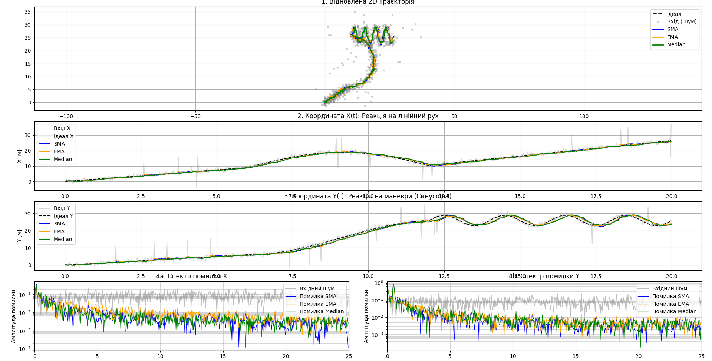
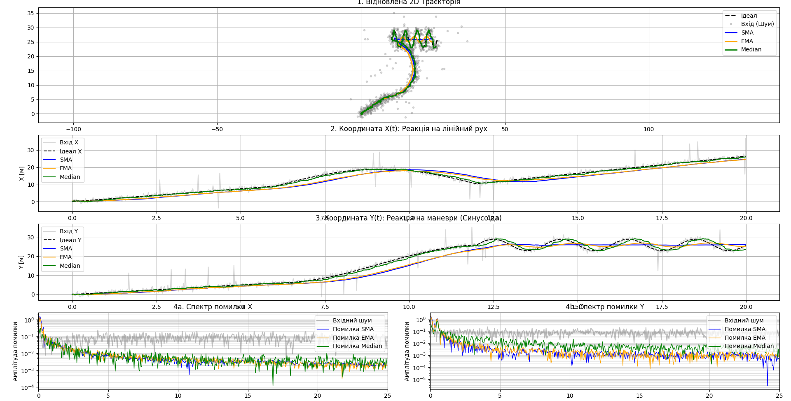
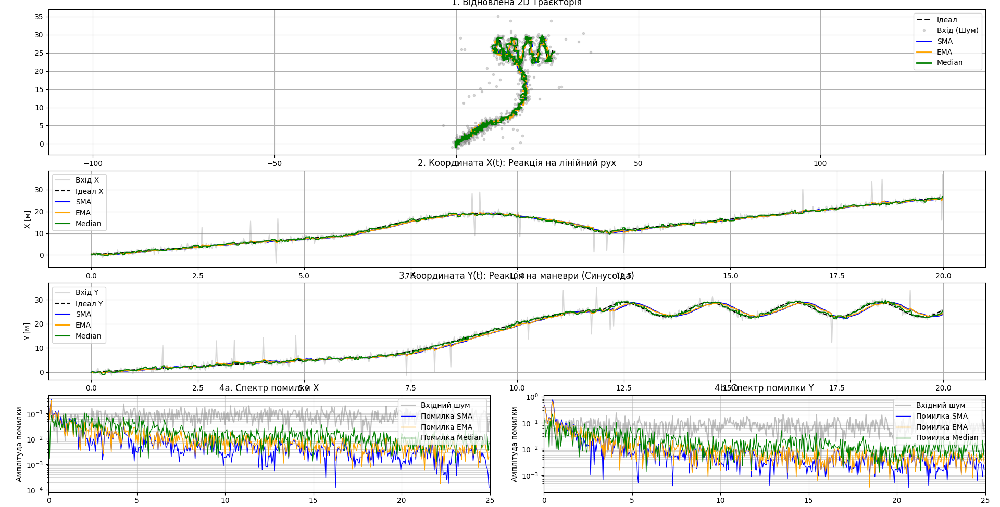

# Обробка координатних даних: Придушення шумів у потоці (Real-time)
**Автор:** Почка Дмитро ІПЗ - 4.02

## Мета роботи
Метою роботи є реалізація архітектури для потокової обробки координатних даних у режимі real-time, імплементація трьох цифрових фільтрів (`SMA`, `EMA`, `Median Filter`) та дослідження компромісу між ступенем згладжування і динамічними спотвореннями сигналу. Окрема увага приділяється спектральному аналізу помилки фільтрації. :contentReference[oaicite:1]{index=1}

## Використані інструменти
- Python
- Google Colab
- NumPy
- Matplotlib
- SciPy :contentReference[oaicite:2]{index=2}

---

## Реалізація

У роботі реалізовано три типи фільтрів для послідовної обробки координат у потоці даних:

- **SMA (Simple Moving Average)** — просте ковзне середнє
- **EMA (Exponential Moving Average)** — експоненційне ковзне середнє
- **Median Filter** — медіанний фільтр :contentReference[oaicite:3]{index=3}

### Реалізовані методи `update()`

```python
class SMAFilter:
    def __init__(self, w):
        self.w = w
        self.q = deque(maxlen=w)
        self.sum = 0.0

    def update(self, x):
        if len(self.q) == self.w:
            self.sum -= self.q[0]

        self.q.append(x)
        self.sum += x

        return self.sum / len(self.q)


class EMAFilter:
    def __init__(self, alpha):
        self.a = alpha
        self.last = None

    def update(self, x):
        if self.last is None:
            self.last = x
        else:
            self.last = self.a * x + (1 - self.a) * self.last

        return self.last


class MedianFilter:
    def __init__(self, w):
        if w % 2 == 0:
            w += 1
        self.w = w
        self.q = deque(maxlen=w)

    def update(self, x):
        self.q.append(x)
        return np.median(self.q)

```
# Графіки
## Експеримент 1. Базовий режим
Вхідні параметри
- W_SMA = 20
- A_EMA = 0.1
- W_MED = 21
- FS = 50 Гц
- DURATION = 20 с
- NOISE_STD = 0.8
- OUTLIER_PROB = 0.02
- OUTLIER_SCALE = 10.0



### Аналіз

У базовому режимі всі три фільтри зменшують високочастотне тремтіння сигналу порівняно з вхідними шумними даними. На 2D-траєкторії видно, що відновлені криві є значно гладшими, ніж вихідний шумний сигнал.

На графіку `Y(t)` в області **13–20 секунд** добре видно ефект **запізнення (lag)**. У цей момент об’єкт рухається по ділянці типу “змійка”, тобто траєкторія швидко змінюється. Через інерційність згладжування фільтри не встигають миттєво повторювати ці зміни, тому їхні криві відстають від чорного пунктиру, який відповідає ідеальному сигналу. Найбільш помітний лаг спостерігається у фільтрів із більшим ефектом усереднення.

Медіанний фільтр у базовому режимі краще справляється з **поодинокими імпульсними викидами**, ніж SMA. Причина полягає в тому, що медіана майже не реагує на один дуже великий аномальний пік, якщо більшість значень у вікні залишаються нормальними. На відміну від цього, SMA усереднює всі значення у вікні, тому різкий викид впливає на середнє і частково “розмазується” на кілька сусідніх точок.

Отже, у базовому режимі:
- `SMA` і `EMA` добре пригнічують звичайний шум;
- `Median` найкраще прибирає одиничні викиди;
- усі фільтри вносять певну затримку на динамічних ділянках траєкторії.


## Експеримент 2. Екстремальне згладжування
Вхідні параметри
- W_SMA = 100
- A_EMA = 0.02
- W_MED = 21



### Аналіз

При екстремальному згладжуванні (`W_SMA = 100`, `A_EMA = 0.02`) фільтри стали значно більш інерційними. Візуально це проявляється тим, що траєкторія стає дуже гладкою, але при цьому фільтровані сигнали починають помітно **запізнюватися** відносно реального руху об’єкта. На поворотах і на ділянці “змійки” криві вже не повторюють точну форму траєкторії, а ніби **зрізають кути**.

Найважливіший ефект видно на графіку **спектру помилки Y** у зоні **низьких частот 0–1 Гц**. У цій області кольорові криві помилки можуть ставати **вищими за сіру лінію вхідного шуму**. На перший погляд це виглядає парадоксально: шум пригнічується, але помилка збільшується.

Пояснення цього ефекту таке: фільтр справді добре прибирає **високочастотний шум**, але натомість починає вносити **динамічне спотворення корисного сигналу**. Через велику інерційність він уже не встигає за реальною траєкторією. У результаті виникає значна затримка та спотворення форми руху. Саме ця помилка форми сигналу і проявляється у спектрі на низьких частотах.

Іншими словами:
- права частина спектра показує залишок шуму;
- ліва частина спектра показує спотворення самої траєкторії.

При екстремальному згладжуванні високочастотний шум дійсно зменшується, але в області **0–1 Гц** зростає помилка, тому що фільтр починає погано відслідковувати повільні, але важливі зміни руху. Саме це і є **парадокс спектру помилки**: шум менший, але загальна помилка на низьких частотах більша через лаг і “зрізання кутів”.

Отже, надмірне згладжування:
- покращує пригнічення шуму;
- погіршує динаміку системи;
- збільшує спотворення корисного сигналу на низьких частотах.


## Експеримент 3. Медіанний фільтр з малим вікном
Вхідні параметри
- W_SMA = 20
- A_EMA = 0.1
- W_MED = 5



### Аналіз

При зменшенні вікна медіанного фільтра до `W_MED = 5` він починає реагувати на зміни траєкторії значно швидше. Це зменшує лаг і покращує проходження динамічних ділянок, оскільки фільтр має меншу інерційність.

Разом із цим зменшується здатність пригнічувати **широкі викиди**, тобто завади, які тривають не одну точку, а кілька сусідніх значень поспіль. Якщо аномальний сигнал займає значну частину малого вікна, медіана вже не може його повністю ігнорувати, тому такий викид частково проходить у вихідний сигнал.

У порівнянні з `SMA`, медіанний фільтр з малим вікном дає менш гладку криву, але краще зберігає форму траєкторії і швидше реагує на зміни. `SMA`, навпаки, сильніше згладжує сигнал, але при цьому є більш чутливим до одиничних великих відхилень і сильніше розмазує їх у часі.

Отже:
- мале вікно `Median` зменшує затримку;
- погіршує боротьбу з довшими викидами;
- дає кращу реакцію на маневри;
- `SMA` є більш гладким, але менш стійким до різких аномалій.

## Висновок

У ході виконання роботи було реалізовано три цифрові фільтри для потокової обробки координатних даних у режимі реального часу: `SMA`, `EMA` та `Median Filter`.

Проведені експерименти показали, що кожен із фільтрів має свої сильні сторони та обмеження:

- **Median Filter** найкраще підходить для видалення **різких імпульсних викидів**, оскільки він стійкий до одиничних аномально великих значень.
- **SMA** та **EMA** краще підходять для **плавного ведення траєкторії** та пригнічення звичайного високочастотного шуму.
- При збільшенні сили згладжування зменшується шум, але зростає **лаг** і спотворення траєкторії.
- Надмірне згладжування призводить до ситуації, коли на низьких частотах помилка зростає через затримку та “зрізання кутів”.

Таким чином, головний висновок роботи полягає в тому, що між гладкістю сигналу та точністю відстеження динаміки існує компроміс. Якщо потрібно прибирати поодинокі збої сенсора, найкращим вибором є медіанний фільтр. Якщо ж важливе плавне ведення траєкторії, доцільніше використовувати `SMA` або `EMA` з помірними параметрами згладжування.

